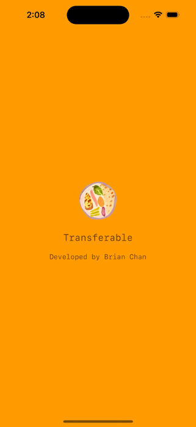
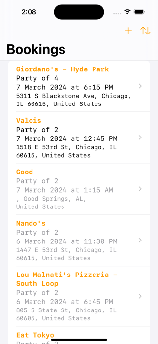
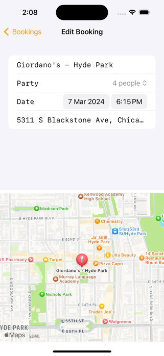

# An iOS app for managing restaurant reservations

  
   
  

## YouTube Demo

Click [Here](https://youtube.com/shorts/gjIliip9jkQ?feature=shared)

## Technologies

- iOS Development
- Swift
- SwiftUI
- SwiftData
- UIKit
- MapKit

## App Description

Elevate your dining experience with our simplistic restaurant booking tracking app. Seamlessly search for restaurants on a dynamic map, and effortlessly edit bookings with details tailored to your preferences – from restaurant name and party size to date, time, and location. The main interface provides a user-friendly dashboard where you can effortlessly manage past and present bookings, filter for your favorite restaurants, and sort your bookings for easy access. This app is a game-changer for anyone who loves to dine out, offering a visually appealing and organized way to stay on top of your dining plans.
